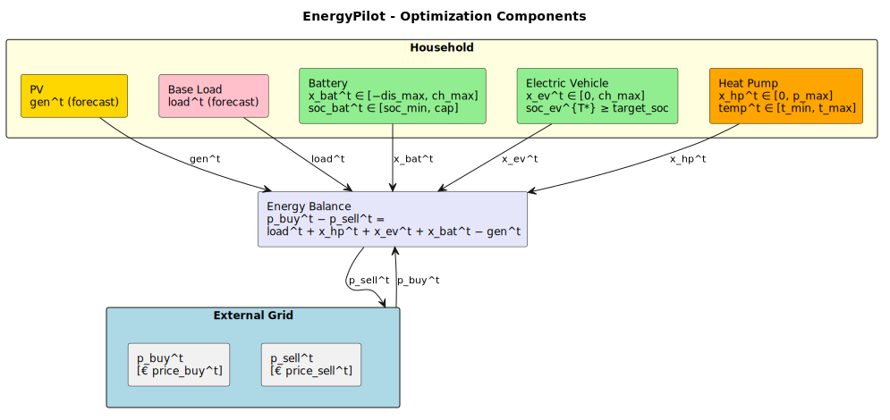

# EnergyPilot

EnergyPilot is a modular framework for cost-optimal household energy scheduling. It coordinates controllable loads — battery storage, electric vehicle charging, and heat pump operation — to minimise electricity costs by exploiting forecast electricity prices and local PV generation.

## Motivation

Electricity prices vary significantly throughout the day. Modern households have increasing flexibility in *when* they consume energy: a battery can be charged during cheap hours, an EV does not need to start charging the moment it is plugged in, and a heat pump can pre-heat a building before prices rise. EnergyPilot makes these decisions automatically, guided by forecasts of prices, solar generation, and weather.

## Approach

The scheduling problem is formulated as a **Mixed Integer Linear Program (MILP)** solved within a **Model Predictive Control (MPC)** loop. At each timestep, the current system state is observed, a forecast trajectory is produced for the planning horizon, and the MILP finds optimal power setpoints for all controllable devices. Only the first step's commands are applied — then the loop repeats with fresh observations.

This rolling-horizon approach lets the system continuously react to new information without committing to a fixed long-term plan.

## Energy Model

A single power balance ties everything together:

```
p_buy − p_sell = load + x_bat + x_ev + x_hp − gen
```

Each controllable device has a decision variable (power setpoint), a state variable (SoC or temperature), and physical dynamics encoded as linear constraints. The MILP minimises total electricity cost — buying cheap, selling surplus, and pre-conditioning devices ahead of expensive periods.

Base load and PV generation are uncontrollable forecast signals, not decision variables.



### Battery
- Decision variable: `x_bat^t ∈ [−discharge_max, charge_max]` (positive = charging)
- State: `soc_bat^t ∈ [soc_min, capacity]`
- Dynamics: `soc^{t+1} = soc^t + x_bat^t · dt · efficiency`

### Electric Vehicle
- Decision variable: `x_ev^t ∈ [−discharge_max, charge_max]`
- State: `soc_ev^t ∈ [0, capacity]`
- Dynamics: same as battery
- Deadline constraint: `soc_ev^{T*} ≥ target_soc`

### Heat Pump
- Decision variable: `x_hp^t ∈ [0, max_power]` (electrical input)
- State: indoor temperature `temp_in^t`
- Dynamics:
  ```
  temp_in^{t+1} = temp_in^t · (1 − λ·dt/C)
                + cop^t · x_hp^t · dt / C
                + λ · dt · temp_out^t / C
  ```
- Comfort constraint: `temp_in^t ∈ [temp_min^t, temp_max^t]`
- COP is precomputed per timestep from the outdoor temperature forecast (Carnot model), keeping the dynamics linear.

## Forecasting

Each passive signal — prices, load, generation, outdoor temperature — is stored as a `TimeSeriesData` object: a sorted list of `(datetime, float)` pairs with linear interpolation. During simulation, signals are precomputed for the full horizon before the MPC loop starts.

Each signal is wrapped in a `TimeSeries`, which couples a `SyntheticExternalState` sensor (reads the precomputed data at the current simulation time) with a `SeriesForecaster` (maps the observed history to a trajectory over the planning horizon). The history is stored internally as a `TimeSeriesData` object, resampled at `dt` intervals before each forecast call.

Two baseline forecasters are provided in `forecasting/baseline_forecasters.py`:

- **`LookupForecaster`** — perfect foresight; reads future values directly from the precomputed `TimeSeriesData`. Represents the theoretical optimum.
- **`ConstantForecaster`** — naïve baseline; repeats the last observed value for the entire horizon.

The main script runs the simulation once per forecasting mode, producing an individual result plot for each mode and a combined comparison plot showing cumulative costs across all modes — with the area between the cheapest and most expensive mode shaded.

The forecasting layer is intentionally decoupled: any forecaster — a trained ML model, a weather API, a simple heuristic — can be dropped in by adding it to `FORECASTING_MODES` in `main.py`.

## Synthetic Simulation

For development and testing, all sensors, actuators, and signals are replaced with synthetic counterparts.

**Passive signals** (price, load, generation, outdoor temperature) are precomputed as `TimeSeriesData` objects using diurnal patterns and stored before the MPC loop starts. Each signal is exposed to the MPC via a `SyntheticExternalState`, which reads the interpolated value at the current simulation time from the `TimeSeriesData`.

**Device states** (battery SoC, EV SoC, indoor temperature) are held in `SyntheticState` objects. After each solve, the `SyntheticActuator` advances the state to the expected next value computed by the optimizer — mirroring the real-world effect of applying the power setpoint.

Simulation time is managed by the `Time` singleton, which is stepped forward by `dt` after each MPC iteration when running in `fast_forward` mode.

The real-world interfaces remain unchanged — the distinction between synthetic and production lives entirely inside individual sensor and actuator implementations.

## Project Structure

```
EnergyPilot/
├── main.py                        Entry point — runs MPC for each forecasting mode
├── plot.py                        Per-mode result plots and forecasting comparison plot
├── real_world_interfaces/         Sensor and Actuator abstractions
│   └── synthetic/                 SyntheticState, SyntheticExternalState, sensor, actuator
├── forecasting/                   Time, TimeSeriesData, TimeSeries, forecaster interface
│   └── baseline_forecasters.py    LookupForecaster, ConstantForecaster
├── optimization/
│   ├── milp/                      Device models and MILP formulation
│   └── mpc/                       MPC loop orchestration, MPCStep, MPCHistory
└── outputs/                       Saved plots
```

## Dependencies

- Python ≥ 3.11
- `numpy`
- `scipy` ≥ 1.9 — MILP solver (HiGHS backend via `scipy.optimize.milp`)
- `matplotlib`
- `sortedcontainers` — sorted list for `TimeSeriesData`

## Limitations & Next Steps

- **Forecast model** — replace `LookupForecaster` with trained models or external APIs for production use
- **Stochastic optimization** — optimizing over multiple forecast scenarios simultaneously would yield more robust decisions
- **Schedulable appliances** — washing machines, dishwashers, etc. fit naturally as one-shot binary-scheduled loads
- **Nonlinear COP** — COP is currently linearized; a nonlinear solver would handle the full temperature-dependent model
